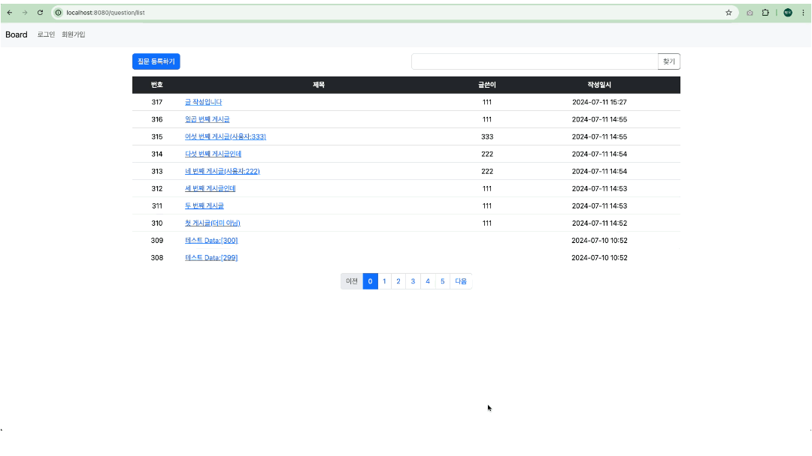

# 게시판 프로젝트

## 1. 프로젝트 소개
개인 프로젝트이며 웹 프로그래밍의 기본인 게시판을 만들어 보았습니다.  
기간: 2024.07.08 ~ 2024.07.11
> 메인 화면

## 2. 프로젝트 기능
- 게시판
    - 게시글 CRUD
    - 답변 CRUD
    - 게시글 추천(좋아요) 기능
    - 답변 추천(좋아요) 기능
    - 게시글 검색 기능
    - 글 작성 시 마크다운 적용
    - 답변 앵커 기능
    - 페이징 처리
- 사용자
    - 회원가입
    - 로그인

## 3. 사용기술
- Java 17
- Spring Boot Version 3.3.1
- Gradle
- JPA
- Spring Security
- H2 Database
- HTML/CSS
- Thymeleaf
- BootStrap
- JavaScript

## 4. 개발도구
- STS4(Spring Tool Suite 4)

## 5. 구현 화면
### 메인 페이지

- 최신 글 순서대로 표시됩니다.
- 작성자 및 작성일시가 표시됩니다.
- 댓글 개수가 표시됩니다.
- 게시글 페이징 기능이 있습니다.
- 게시글 찾기 검색 창이 있습니다.
- /를 입력할 경우 루트 페이지(question/list)로 이동합니다.

 

### 게시글 작성

- 로그인하지 않으면 게시글 작성이 되지 않습니다.

 

### 게시글 수정

- 게시글 작성자가 아닌 이상 수정되지 않습니다.
- 게시글 작성자 본인이 수정해야 합니다.
- 게시글 수정시간이 표시됩니다.

 

### 게시글 삭제

- 게시글 작성자가 아닌 이상 삭제되지 않습니다.
- 게시글 작성자 본인이 삭제해야 합니다.
- 삭제 전 `정말로 삭제하시겠습니까?` 메시지 표시

### 답변 작성

- 로그인하지 않으면 답변 작성이 되지 않습니다.

 

### 댓글 수정

- 답변 작성자가 아닌 이상 수정되지 않습니다.
- 답변 작성자 본인이 수정해야 합니다.
- 답변 수정시간이 표시됩니다.

 

### 답변 삭제

- 답변 작성자가 아닌 이상 삭제되지 않습니다.
- 답변 작성자 본인이 삭제해야 합니다.
- 삭제 전 `정말로 삭제하시겠습니까?` 메시지 표시.

### 회원가입

- 사용자ID가 3~25 사이여야 합니다
    - 아닐 경우 `크기가 3에서 25 사이여야 합니다`라는 메시지가 표시됩니다.
- 2개의 비밀번호가 같지 않으면 회원가입이 되지 않습니다.
    - 같지 않을 경우 `2개의 비밀번호가 일치하지 않습니다`라는 메시지가 표시됩니다.
- 이메일 형식이 맞아야 회원가입이 됩니다.
    - 이메일을 입력하지 않을 경우 `이메일은 필수입니다`라는 메시지가 표시됩니다.

 

### 로그인

- 올바르지 않을 경우 `사용ID 또는 비밀번호를 확인해 주세요.`라는 메시지가 표시됩니다.

 

### 로그아웃

- 게시글 작성자가 아닌 이상 삭제되지 않습니다.
- 게시글 작성자 본인이 삭제해야 합니다.
- 삭제 전 `정말로 삭제하시겠습니까?` 메시지 표시

### 추천(좋아요) 기능 

- `정말로 추천하시겠습니까?`라는 메시지가 표시된다.
- 로그인 한 사용자만 추천이 가능하다.
    - 확인을 누르면 로그인 화면으로 이동한다.
- 추천은 한 번만 가능하며 다른 이용자가 추천할 경우 숫자가 증가한다.

 

### 게시글 찾기 기능

- 원하는 게시글의 일부분을 입력한 뒤 `찾기` 버튼 선택 시 원하는 게시글이 표시된다.

 

### 마크 다운

- 마크 다운 문법 사용이 가능하다.
- 게시글 내용/답변 내용 모두 가능하다.

 

### 댓글 수 확인

- 해당 게시글의 댓글 수 확인이 가능합니다.

 

### 앵커 기능

- 댓글을 작성한 위치로 자동 이동됩니다.

 

### 페이징 처리

- 게시글이 페이지 당 10개씩 표시됩니다.
- 페이지별 좌우 5개 기준으로 표시됩니다